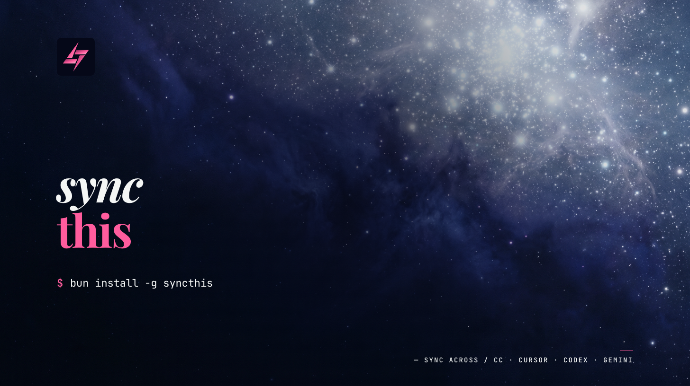

# syncthis

[](https://www.npmjs.com/package/@hungv47/syncthis)
[](https://syncthis.forsvn.com)
[](./LICENSE)




**One CLI to keep MCP servers in sync across your AI coding agents — plus a plugin mirror and skills delegation.**

You install MCPs, plugins, and skills with whatever tool you already use — `mcpm`, `claude mcp add`, `claude plugin install`, `npx plugins add`, `npx skills add`, and so on. syncthis is the sync layer on top. It does three things and nothing more:

- **MCP servers** — union sync across all 11 agents: read every agent's config, compute the union, write it back, report conflicts. *(Nothing upstream does cross-agent MCP sync — this is syncthis's reason to exist.)*
- **Plugins** — `mirror` one agent's installed plugins onto another. Limited to the two agents with a native install CLI: **Claude Code ↔ Codex**.
- **Skills** — delegated entirely to [`vercel-labs/skills`](https://github.com/vercel-labs/skills) (`npx skills update -y`), which handles 55 agents.

Supported agents for MCP sync: **Claude Code, Codex, Cursor, OpenCode, Gemini CLI, Kimi CLI, Windsurf, Antigravity, GitHub Copilot CLI, OpenClaw, Hermes** — 11 in total.

## Quick start

No install required — run it on demand:

```bash
npx @hungv47/syncthis run
```

That mirrors MCP servers across every detected agent, then refreshes skills via `npx skills update -y`. Add `--dry-run` to preview without writing.

If you'd rather have `syncthis` on your `PATH`:

```bash
bun install -g @hungv47/syncthis
# or
npm install -g @hungv47/syncthis
```

After global install, drop the `npx @hungv47/syncthis` prefix — every command below works as `syncthis <cmd>` instead.

## What syncthis is — and isn't

| | |
|---|---|
| ✅ syncs MCP server configs across 11 coding agents | ❌ installs MCP servers (use `mcpm`, `claude mcp add`, etc.) |
| ✅ refreshes skills via `npx skills update -y` | ❌ installs skills from registries (use `npx skills add`) |
| ✅ supports one-way mirror and fan-out from one agent | ❌ starts desktop-owned MCP servers like Paper/Pencil |
| ✅ removes one MCP server across every supported agent | ❌ treats legacy/unmanaged MCP files as source of truth |
| ✅ mirrors plugins from one agent to another (Claude ↔ Codex) | ❌ installs plugins (use `npx plugins add`, `claude plugin install`, etc.) |
| ✅ lists installed plugins per agent (`plugin list`) | ❌ uninstalls plugins (use `claude plugin uninstall`, `codex plugin remove`) |

## How it works

```bash
# 1. install MCP servers / skills / plugins with your preferred tool
mcpm install github
npx skills add vercel-labs/agent-skills --skill frontend-design
claude plugin install vercel-plugin@plugins-cli

# 2. mirror MCP servers + refresh skills across every agent
syncthis run
```

No config file, no source-of-truth to maintain. Each agent's own config is the truth; syncthis just keeps them in agreement.

For removals, do not rely on union sync — it is additive only. Use the explicit `rm` commands (see below); otherwise a server or plugin that still exists in one agent will be re-propagated to the others on the next `run`.

## Commands

```
syncthis                              # interactive picker (or HELP if non-TTY)
syncthis run    [--dry-run] [--no-skills]   # MCP + skills (alias for sync)
syncthis sync   [--dry-run] [--no-skills]   # same as run
syncthis mcp    [--dry-run]                 # MCP only — skip skills update
syncthis skills                             # skills only — `npx skills update -y`
syncthis <from> <to> [--yes] [--dry-run]    # one-way mirror MCP from one agent to another
syncthis from <agent> --all [--yes] [--dry-run] # mirror one agent to every other agent
syncthis rm <server> --all [--yes] [--dry-run]  # remove one MCP server everywhere
syncthis doctor                             # MCP coverage + conflict report

# Plugins (Claude ↔ Codex)
syncthis mirror <primary> [--provision] [--remove-stale] [--yes] [--dry-run] # push primary's plugins onto the other agent
syncthis plugin list                        # list installed plugins per agent (read-only)
syncthis help
```

`--dry-run` prints what would change without writing.
`--no-skills` skips the skills update phase.
`--provision` (mirror) registers a plugin's source marketplace on the target before installing, when the target doesn't already have it (shells `npx plugins add` — hits the network).
`--remove-stale` (mirror) also uninstalls plugins on the target that the primary doesn't have.
`--all` is required for fan-out and remove-all commands.
`--yes` skips the confirmation prompt for destructive commands.

## Supported agents

| Agent | Config file |
|---|---|
| `claude-code` | `~/.claude.json` (merges top-level + every `projects.*.mcpServers` scope) |
| `cursor` | `~/.cursor/mcp.json` |
| `codex` | `~/.codex/config.toml` |
| `gemini-cli` | `~/.gemini/settings.json` |
| `kimi-cli` | `~/.kimi/mcp.json` |
| `antigravity` | `~/.gemini/antigravity/mcp_config.json` |
| `github-copilot` | `~/.copilot/mcp-config.json` (override via `$COPILOT_HOME`) |
| `windsurf` | `~/.codeium/windsurf/mcp_config.json` |
| `opencode` | `~/.config/opencode/opencode.json` |
| `openclaw` | `~/.openclaw/openclaw.json` (override via `$OPENCLAW_CONFIG_PATH`) |
| `hermes-agent` | `~/.hermes/config.yaml` |

## What `syncthis run` does

1. **Reads** MCP servers from each agent's config. For Claude, merges top-level + every per-project scope.
2. **Computes the union.** Any server present in any agent gets propagated to every agent.
3. **Detects conflicts.** If the same server name has different configs across agents, syncthis leaves each agent's own version untouched and reports the conflict — you resolve manually.
4. **Refreshes skills** by running `npx skills update -y`. Skills sync is delegated to `vercel-labs/skills`, which handles 55 agents.

Every target file is backed up to `<file>.syncthis.bak` on the first write so you can recover if something goes wrong.

## Directional sync

```bash
syncthis claude-code codex --dry-run
```

Mirrors MCP servers from `claude-code` to `codex` (one-way, destructive). Shows a diff and asks for confirmation before writing — pass `--yes` to skip the prompt. The conflict policy of the union sync does NOT apply here: this is an explicit overwrite of `to`'s config with `from`'s.

To fan out one clean source to every other supported agent:

```bash
syncthis from antigravity --all --dry-run
syncthis from antigravity --all --yes
```

## Conflict example (union sync)

```
$ syncthis run
read 3 server name(s) across 11 agent(s); 2 synced, 1 conflict(s)
  ✓ claude-code     ~/.claude.json
  ✓ cursor          ~/.cursor/mcp.json
  ...

1 conflict(s) — left each agent's own copy untouched:
  ~ github
      in claude-code
      in cursor
  resolve by deleting the version you don't want, then re-run sync.
```

## Removing a server

Use the explicit remove command:

```bash
syncthis rm executor --all --dry-run
syncthis rm executor --all --yes
```

`syncthis run` is a union sync. If `executor` still exists in one agent, union sync will re-propagate it. `syncthis rm` avoids that by deleting the named server from every supported agent in one pass.

## Plugins

Plugins aren't config records like MCP servers — they're installed artifact bundles with per-agent identity and install mechanics. They're only portable between agents that expose a native install CLI, which today means **Claude Code (`claude plugin install`) and Codex (`codex plugin add`)**. So syncthis does exactly two plugin things: list what's installed, and mirror one of those two agents onto the other.

```bash
# See what's installed where (read-only)
syncthis plugin list

# Make one agent the source of truth: install its plugins on the other
syncthis mirror claude-code --dry-run
syncthis mirror claude-code --yes
syncthis mirror claude-code --provision --yes      # also register missing marketplaces on the target first
syncthis mirror claude-code --remove-stale --yes   # also uninstall plugins the primary doesn't have
```

`mirror` is destructive — it installs the primary's plugins onto the target (and with `--remove-stale`, uninstalls what the primary doesn't have). It shows a diff and prompts for confirmation unless you pass `--yes`. Installs delegate to the target's native CLI; nothing is written directly to a plugin cache.

`mirror` reads the target's **real** install state (e.g. `codex plugin list`), not just what's registered in config — so it installs exactly what's missing and won't skip plugins the target only *appears* to have. It resolves each plugin to the target's own `<name>@<marketplace>` automatically.

A plugin the target can't install is reported as **skipped** with a reason, not a failure — the run only exits non-zero on a genuine install error. Two common skips:

- **Marketplace not registered on the target.** Add `--provision` and syncthis will register the plugin's source repo for you (`npx plugins add <owner/repo> --target codex`, repo read from the primary's marketplace list) and then install it. Off by default to keep `mirror` fast and local.
- **Skills-only bundles.** Some "plugins" are really skill collections; they sync as skills, not Codex plugins. `mirror` points you to `syncthis run` (which runs `npx skills update -y`) for those.

Installing plugins in the first place is left to the native tools (`claude plugin install`, `codex plugin add`, `npx plugins add`). Uninstalling is too (`claude plugin uninstall`, `codex plugin remove`).

**Why not the other agents?** Cursor has no plugin install CLI, and OpenCode plugins are npm runtime modules (a different format) — neither can be a mirror target. The remaining 7 agents have no GitHub-bundle plugin surface at all. They all stay in MCP-sync + skills scope.

## Desktop-owned servers

Paper and Pencil can be desktop-owned: the config may be synced, but the server only responds when the desktop client starts it. syncthis only syncs config; it does not launch those apps.

## Unmanaged MCP files

`syncthis doctor` warns when known side files contain MCP servers that syncthis does not write, such as VS Code user MCP config or the legacy `~/.config/mcp/servers.json`. Treat those as app-owned or legacy files, not the canonical source for coding-agent sync.

## Skills

Skills are handled entirely by [`npx skills`](https://github.com/vercel-labs/skills) (Vercel Labs). syncthis runs `npx skills update -y` as part of `run`/`sync` to refresh registry-installed skills. For installing skills, use `npx skills add <repo>` directly. See [skills.sh](https://skills.sh) for the registry.

## License

MIT
