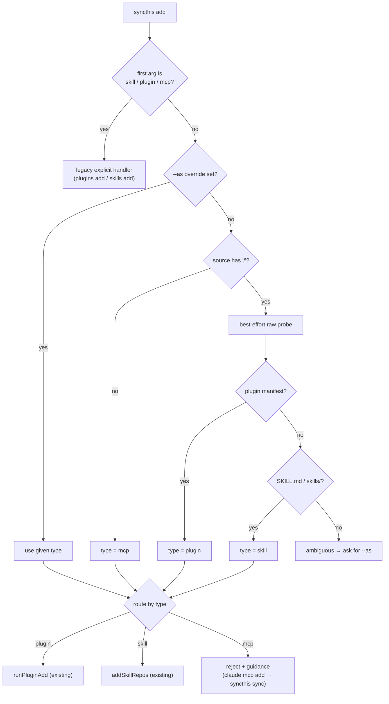

# feat: Unified auto-detecting `add` verb + plugin-propagation repositioning

**Target repo:** `syncthis` (`hungv47/syncthis`). All paths below are relative to that repo root.

## Summary

Two pieces, both small, both serving one goal: make syncthis's real differentiator — **plugin-bundle propagation across every agent** — legible and complete. (1) Reposition the README/npm hero away from the weakening "nothing else does cross-agent MCP sync" claim and toward the uncontested one. (2) Build the one genuinely missing code feature: a unified `syncthis add <repo|name>` that **auto-detects** type and routes into the install primitives that already exist.

This is a **time-boxed validation bet**, not an expansion. No daemon, no host, no new runtime dependency. The founding principle ("agents are the source of truth; syncthis keeps them aligned") stands.

> **Read against the kill-gate (out of scope for this plan, but governs it):** absent traction, archive syncthis by **2026-08-01** and return attention to FORSVN; if executor.sh ships Claude-plugin support before then, the gate triggers immediately. This plan is the last validation work, not an open commitment.

---

## Problem Frame

syncthis already completed most of the install/remove loop (verified in code, not just docs):

- **Remove loop — done.** `skills rm` (`removeSkillNames`, `src/skills.ts`), `mcp rm` (`runRemove`, `src/sync.ts`), guarded `plugins rm` all ship with the removal rails.
- **Per-type add — done.** `plugins add` (`runPluginAdd`, `src/plugins/add.ts`) and `skills add` (`addSkillRepos`) ship and are tested.

What's missing is the feature that makes the moat *demo-able in one line*: a top-level `add <repo|name>` that figures out whether the source is a plugin or a skill and propagates it everywhere, without the user naming the type. Today you must say `plugins add` or `skills add`; there is no auto-detecting entrypoint and no `detectType` logic anywhere in the tree.

Separately, the README still leads with "Nothing else does cross-agent MCP sync — that's why it exists" (appears twice). Research shows ~7 rival CLIs plus executor.sh now occupy that lane, while **none** handle Claude plugin bundles. The hero claim points at the weakening moat instead of the strong one.

---

## Requirements

- **R1** — A `syncthis add <repo|name>` command exists that auto-detects the source type and routes to the correct existing install path, honoring `--all | --agents <list>` scope and `--dry-run`.
- **R2** — Type detection distinguishes **plugin** vs **skill** for a source repo, and gives a deterministic `--as <type>` override that skips detection.
- **R3** — `add` is **additive only** and reuses existing primitives (`runPluginAdd`, `addSkillRepos`); it introduces no new install or removal logic and does not touch the removal rails.
- **R4** — `add` preserves the **no-`add mcp`** boundary: a source that resolves to "MCP server" is not installed; it returns guidance (see KTD-2). *(Pending confirmation — Open Question OQ1.)*
- **R5** — The new top-level `add` coexists with the explicit `plugins add` / `skills add` verbs and the legacy `add skill|plugin <x>` grammar without breaking `tests/cli-routing.test.ts`.
- **R6** — README hero and npm `description` lead with plugin-bundle propagation; the false/weakening sync-exclusivity claim is removed.
- **R7** — Zero new runtime dependencies; the published artifact stays a single self-contained Node bundle. No daemon or persistent process.

**Sacred elements that must remain intact** (`CLAUDE.md` → "Sacred elements"): additive sync/mirror never delete; removal only via guarded commands; `.syncthis.bak` on first write; union-sync conflict policy (leave each agent's own copy untouched); `0600` on secret-bearing files; directional confirmation; Claude per-project scope merge.

---

## Key Technical Decisions

### KTD-1 — Type detection: token shape + best-effort raw probe + `--as` override
A bare token with no `/` is not a repo → not a plugin/skill source. For an `owner/repo` slug, detect by a single best-effort HTTPS GET against the repo's raw manifest paths (GitHub raw): presence of `.claude-plugin/plugin.json` (or `plugin.json` / marketplace manifest) → **plugin**; else presence of `SKILL.md` or a `skills/` entry → **skill**. Uses the Node ≥18 global `fetch` — **no new dependency, no daemon, one-shot request**. A `--as plugin|skill` flag bypasses detection entirely and is the documented path for non-GitHub hosts, offline use, or ambiguity.
- **Why:** keeps the zero-dep / no-infra promise; the override gives determinism where a network probe can't.
- **Ambiguity rule:** a repo exposing *both* a plugin manifest and skills resolves to **plugin** (the richest bundle; `mirror`/`runPluginAdd` already decompose its skills downstream).
- **Alternatives:** clone-and-inspect (heavier, needs git); trial-install via `npx plugins` then fall back (side-effectful, violates `--dry-run`). Both rejected.

### KTD-2 — `add` does not install MCP servers (preserve the sacred boundary)
The 2026-06-01 `capabilities-plan.md` specifies "bare name → mcp" with "native MCP write." The shipped product later hardened the opposite into a boundary: *"There is no `add mcp` — syncthis mirrors MCP servers, it does not install them."* **This plan treats the capabilities-plan line as superseded.** `add` handles **plugin** and **skill** only. A source that looks like a bare MCP name returns a clear message: *"syncthis doesn't install MCP servers. Add it with `claude mcp add <name>` (or mcpm), then `syncthis sync`."*
- **Why:** preserves the founding principle and the documented sacred boundary; smaller, more consistent surface; avoids a contradiction with `mcp sync` being install-free.
- **Flagged as OQ1** for explicit confirmation before U3 is built, since it reverses a decision-locked plan line.

### KTD-3 — Reuse primitives; `add` is a router, not new install logic
`runAdd` dispatches: plugin → `runPluginAdd` (existing), skill → `addSkillRepos` (existing). No new install code, no new write path, removal rails untouched. The unit's job is detection + dispatch + scope/flag plumbing + preview.

### KTD-4 — Coexist with explicit + legacy grammar
`cmdAdd` inspects the first positional: if it is `skill` / `plugin` / `mcp`, route to the existing explicit handler (legacy `add skill|plugin`); otherwise treat the positional(s) as source(s) and auto-detect. This leaves `plugins add` / `skills add` and the legacy aliases pinned by `tests/cli-routing.test.ts` unchanged.

---

## High-Level Technical Design

Detection → dispatch flow for `syncthis add <source> [--as T] [--all|--agents …] [--dry-run]`:

The diagram is authoritative for control flow; per-unit fields below own the details.

---

## Implementation Units

### U1. Reposition the moat (README + npm + demo)
**Goal:** Make the plugin-propagation differentiator the lead message; remove the weakening sync-exclusivity claim. Ships independently and first — the highest-ROI, near-zero-code move.
**Requirements:** R6.
**Dependencies:** none.
**Files:** `README.md`, `package.json` (the `description` field), `docs/demos/` (tape + rendered GIF).
**Approach:**
- Replace the hero lead and the second occurrence of "Nothing else does cross-agent MCP sync — that's why it exists" with the true line: *"One plugin install on Claude propagates its skills and MCP servers to every other agent — the only tool that understands plugin bundles."* Keep cross-agent MCP union sync as a listed capability, not the headline.
- Update `package.json` `description` to match (keep it npm-length-reasonable).
- Render a propagation demo GIF. Prefer an existing tape in `docs/demos/tapes/`; if none shows plugin propagation, add a `plugins-mirror.tape` and render via `docs/demos/build.sh`.
- **Do not** edit the "What this repo is NOT" section here — that revision is tied to the `add` verb landing (U4).
**Patterns to follow:** existing README voice; existing VHS tape structure in `docs/demos/tapes/` and `docs/demos/build.sh`.
**Test scenarios:** `Test expectation: none — docs/marketing copy and a rendered asset; no behavioral change.`
**Verification:** README hero leads with plugin propagation; the exclusivity claim no longer appears; `npm`-facing `description` matches; a propagation GIF renders and is referenced in the README.

### U2. Source type detection (`detectSourceType`)
**Goal:** Classify a source token as `plugin` | `skill` | `mcp` | `ambiguous`, with a hard `--as` override.
**Requirements:** R2, R7.
**Dependencies:** none.
**Files:** `src/plugins/detect.ts` (new), `tests/add-detect.test.ts` (new).
**Approach:**
- Pure-by-default resolver: shape rules first (no `/` → `mcp`; `--as` → that type, no probe). For `owner/repo`, a single best-effort `fetch` of raw manifest paths per KTD-1, behind a small timeout, with all network failure → `ambiguous` (never throw).
- Validate the slug with the existing `isSafeRepoSlug` (`src/plugins/shell.ts`) before any probe.
- Return a typed result `{ type, reason, probed: boolean }` so the router can explain its decision in `--dry-run`.
**Patterns to follow:** `isSafeRepoSlug` / `run` helpers in `src/plugins/shell.ts`; the option-object + typed-result style in `src/plugins/add.ts`.
**Test scenarios:**
- Bare name (`some-server`, no slash) → `mcp`.
- `--as plugin` / `--as skill` overrides win and skip the probe (assert no network call).
- `owner/repo` whose probe finds a plugin manifest → `plugin`.
- `owner/repo` whose probe finds only `SKILL.md`/`skills/` → `skill`.
- `owner/repo` exposing both → `plugin` (ambiguity rule).
- Probe network failure / non-GitHub host → `ambiguous` (no throw), reason names `--as`.
- Unsafe slug → rejected before any probe.
**Verification:** all detection cases resolve deterministically; offline path degrades to `ambiguous` without throwing; no new dependency added to `package.json`.

### U3. Top-level `add` router + `runAdd` dispatch
**Goal:** Wire detection into the existing install primitives behind one command, honoring scope + `--dry-run`, additive only.
**Requirements:** R1, R3, R4, R5.
**Dependencies:** U2. **Blocked on OQ1 confirmation** (whether `mcp` rejects vs installs).
**Files:** `src/plugins/add.ts` (add `runAdd` orchestrator alongside `runPluginAdd`), `bin/syncthis.ts` (`cmdAdd` router + help), `tests/add-router.test.ts` (new), `tests/cli-routing.test.ts` (extend).
**Approach:**
- `cmdAdd`: if first positional ∈ {`skill`,`plugin`,`mcp`} → delegate to the existing explicit handler (legacy grammar preserved); else collect source(s), parse `--as`, `--all`/`--agents` (mutually exclusive — reuse the existing scope-parse + error), `--dry-run`.
- `runAdd`: for each source, call `detectSourceType`, then dispatch — `plugin` → `runPluginAdd`; `skill` → `addSkillRepos`; `mcp` → guidance message per KTD-2; `ambiguous` → prompt for `--as` (non-TTY: error naming `--as`).
- Preview path mirrors `runPluginAdd`'s existing dry-run (resolve-without-writing) so `--dry-run` shows detected type + would-add per agent.
- Additive only — no confirmation prompt for `add` (matches existing `skills add` / `plugins add`); removal rails are not in this path.
**Patterns to follow:** scope parsing + `--all`/`--agents` mutual-exclusion and `runPluginAdd` preview/apply split in `src/plugins/add.ts`; noun-router delegation in `bin/syncthis.ts` (`cmdPlugins`/`cmdSkills`); alias-equivalence assertions in `tests/cli-routing.test.ts`.
**Test scenarios:**
- `add skill <repo>` / `add plugin <name>` still route to the legacy explicit handlers (assert unchanged).
- `add <repo-with-plugin-manifest> --all` dispatches to `runPluginAdd` with all agents.
- `add <repo-with-skill> --agents a,b` dispatches to `addSkillRepos` scoped to a,b.
- `add <bare-name>` → guidance message, no write, exit non-error or documented code (per OQ1).
- `--all` and `--agents` together → the existing mutual-exclusion error (no silent winner).
- `--dry-run` writes nothing and reports detected type + per-agent would-add.
- ambiguous source, non-TTY, no `--as` → error naming `--as`; TTY → prompt.
- `add` performs no removals and leaves `.syncthis.bak`/conflict behavior of downstream writes intact (covered transitively by `runPluginAdd`/`addSkillRepos` tests; assert no removal call here).
**Verification:** `bun test` + `bunx tsc --noEmit` green; routing tests prove coexistence; dry-run is write-free.

### U4. Docs + help for the unified `add`
**Goal:** Reflect the new capability in user-facing help and the repo's identity docs, including the explicit MCP carve-out.
**Requirements:** R1, R4.
**Dependencies:** U3.
**Files:** `bin/syncthis.ts` (top-level help + a new `add` help block), `README.md` (commands section), `CLAUDE.md` ("Commands" + "What this repo is NOT").
**Approach:**
- Add `syncthis add <repo|name> [--as plugin|skill] --all|--agents <list> [--dry-run]` to `syncthis help` and a focused `syncthis add help`.
- In `CLAUDE.md`: revise the "Not an MCP server installer" line per the capabilities-plan follow-up to "cross-agent capability installer (plugins + skills) — still not an MCP installer," and document the auto-detect + `--as` behavior and the MCP carve-out. Keep the plugin-additive-only sacred element wording intact.
- Note `add` in the README commands list near `plugins add` / `skills add`.
**Patterns to follow:** existing `*_HELP` string blocks and the "Commands"/"What this is NOT" sections already in `bin/syncthis.ts` and `CLAUDE.md`.
**Test scenarios:** `Test expectation: none — help-string and documentation changes. (If `tests/cli-routing.test.ts` asserts help routing for new verbs, extend it to cover `add help`.)`
**Verification:** `syncthis help` and `syncthis add help` show the verb; `CLAUDE.md`/README describe auto-detect, `--as`, and the MCP carve-out consistently with U3 behavior.

---

## Scope Boundaries

**In scope:** README/npm repositioning + demo (U1); auto-detecting `add` for plugin + skill (U2–U3); the docs/help to match (U4).

### Deferred to Follow-Up Work
- **Phase 4 — mcpm registry source** for `add mcp <name>` resolution. Out per the strategic frame (FORSVN time); also depends on resolving OQ1.
- A dedicated propagation **tape** if U1 reuses an existing demo for now.

### Outside this product's identity
- **`add mcp` that installs servers.** syncthis mirrors MCP; it does not install. Preserved as a sacred boundary (KTD-2), not a deferral.
- **Any host / daemon / aggregator runtime.** Explicitly rejected in the originating brainstorm.

---

## Open Questions

- **OQ1 (confirm before U3): does `add` reject MCP sources, or install them?** Recommended: **reject with guidance** (KTD-2) to preserve the sacred boundary and the founding principle. Building U3 the other way would reverse a documented boundary and is not recommended. *Blocking for U3 only; U1, U2, U4-docs can proceed regardless.*
- **OQ2 (execution-time): demo asset** — reuse an existing tape or add `plugins-mirror.tape`? Resolve when rendering U1.
- **OQ3 (execution-time): ambiguity UX** — exact TTY prompt wording when a probe is inconclusive; default rule (prefer plugin) is decided, copy is not.

---

## Risks & Dependencies

- **Detection false-positives on non-GitHub or moved repos.** Mitigation: `--as` override is first-class and documented; inconclusive probes degrade to `ambiguous`, never a wrong silent install.
- **A network probe in a tool that has been effectively network-free.** Mitigation: one-shot, timeout-bounded, opt-out via `--as`, failure-soft; documented in help. No daemon, no persistent process.
- **Routing regressions** against the legacy alias grid. Mitigation: extend `tests/cli-routing.test.ts` and keep `cmdAdd` a thin delegator.
- **Dependency:** U3 depends on U2 and on OQ1; U4 depends on U3. U1 is independent and should land first.

---

## Verification

Per-unit verification above. Whole-plan gate (hand-run; do not assume): `bun test` and `bunx tsc --noEmit` both green, with new `tests/add-detect.test.ts` and `tests/add-router.test.ts` plus the extended `tests/cli-routing.test.ts`. Manual smoke: `syncthis add <known-plugin-repo> --dry-run` and `syncthis add <known-skill-repo> --dry-run` report correct detected type and write nothing.
